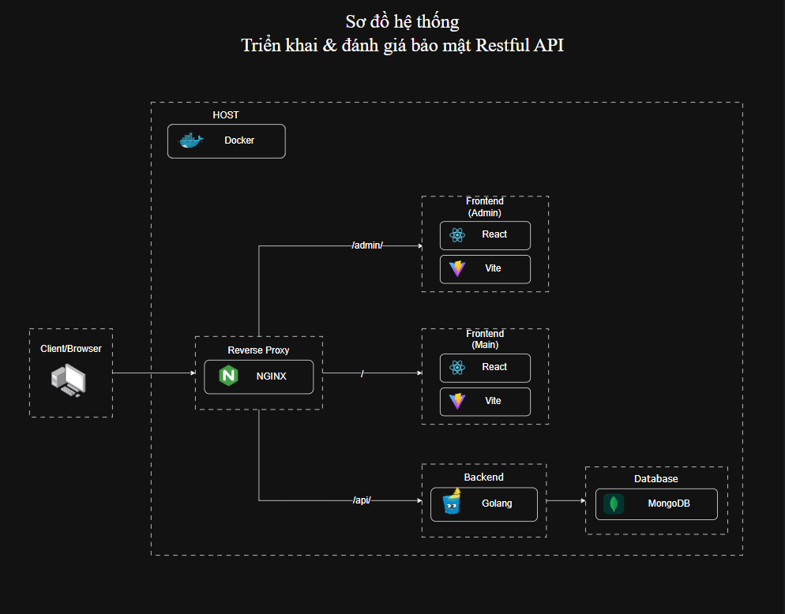

# 🛒 Simple E-commerce Platform

A simple full-stack e-commerce platform built with modern technologies, featuring a customer shopping interface and robust backend services.

## ✨ Features

### 🛍️ Customer Features
- Browse products by categories and price ranges
- Advanced search and filtering
- Shopping cart with guest support
- User authentication and profiles
- Order management and tracking
- Responsive design for all devices
- Choose address from list <Vietnamese> 
- Cash on Delivery payment

### 🔧 Technical Features
- RESTful API with JWT authentication
- Image upload and management
- Cart synchronization between guest and authenticated users
- Real-time updates and notifications
- Secure data handling

## 🚀 Tech Stack

**Frontend:**
- React 18 + Vite
- Tailwind CSS
- React Router + Axios
- React Toastify + React Slick

**Backend:**
- Go + Gin Framework
- MongoDB
- JWT Authentication
- Bcrypt + CORS

**Infrastructure:**
- Docker + Docker Compose
- Nginx reverse proxy

## 🛡️ Security Features

- JWT Authentication with secure token handling
- Password hashing with Bcrypt
- CORS protection for cross-origin requests
- XSS protection through React
- Storage and handle token in cookie
- Input validation
- SSL/TLS encryption (just for demo, this project use openssl to generate self-signed certificate)